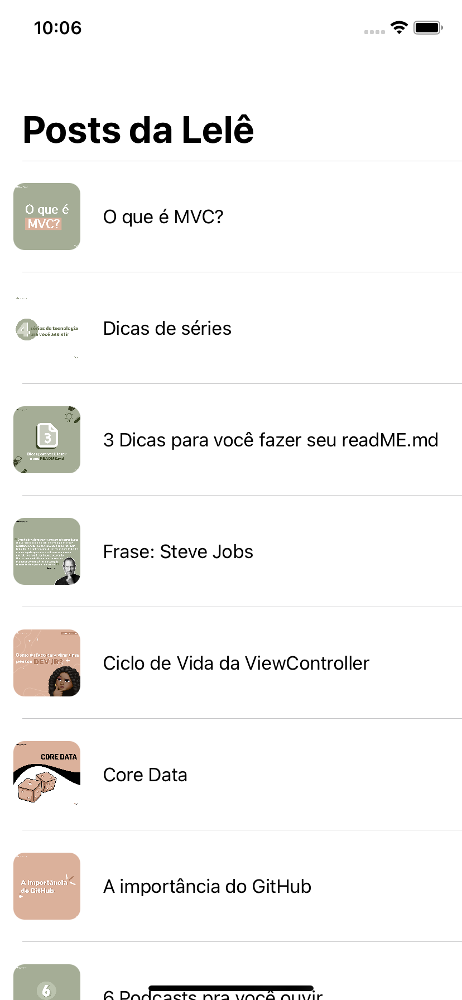

# Aprendendo-ViewCode

# Introdução
- Esse app foi desenvolvido para praticar os estudo de ViewCode 
    - Arquiteutura utilizada [MVC](https://www.devmedia.com.br/introducao-ao-padrao-mvc/29308)

# Requirimentos para excecutar a aplicação
Antes de abrir o app na máquina, é necessário: 
    - iOS 13 ou superior.
    - Xcode 11.5 ou superior. 
    
# Screenshots e uso
- É exibido apenas uma View, onde mostra uma lista de postagens feitas por mim. 

# Observações
Ex.: Esse aplicativo foi desenvolvido por [@leticiafaleia](https://github.com/leticiafaleia) - através do vídeo do [Sean Allen](https://www.youtube.com/watch?v=bXHinfFMkFw&t=275s).
